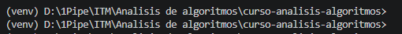

# Ejercicio de clase - Semana 02

## requirements.txt
El archivo requirements.txt ubicado en la carpeta raíz del proyecto contiene las librerías básicas necesarias para su ejecución. La librería principal necesaria es `python matplotlib==3.11.1`. Las otras librerías presentes en el archivo son librerías que se instalan juntamente con matplotlib.

El archivo fue generado siguiendo los pasos:
1. Se ejecutó el comando `pip install matplotlib`
2. Usando `pip freeze > requirements.txt` se creó el archivo .txt con las librerías instaladas en el paso anterior.

## ¿Cómo preparar el entorno para el ejercicio de clase?
1. Inicie el entorno virtual, ejecute los comandos en CMD:
    - `python -m venv venv` para crearlo
    - `venv\Scripts\activate` para iniciarlo en Windows
    - `source venv/bin/activate` para iniciarlo en Linux/Mac

2. Asegúrese que el entorno virtual está activo. La terminal debería mostrar el texto (venv) como se ve en la imagen:

3. Instale las librerías del archivo de requerimientos. Ejecute en la terminal `pip install -r requirements.txt`

4. Ejecute los archivos de Python
- clasificador_anios.py
- refactor_pep8.py