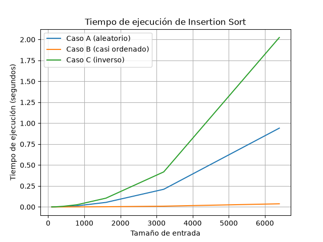
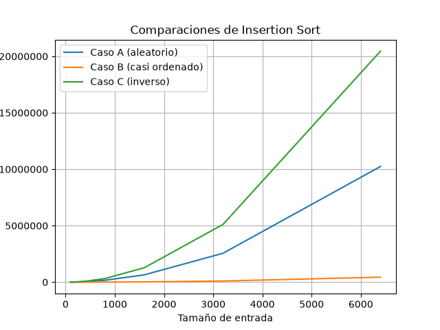
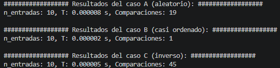
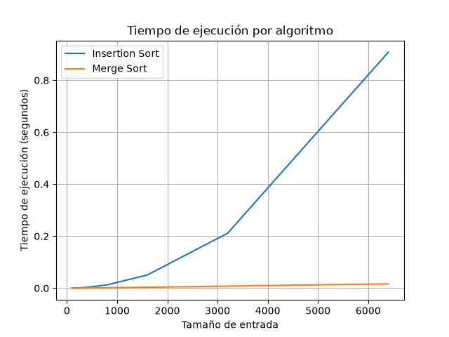

### Felipe Londoño García - Carné 21158186
### Grupo - 190304006-3

# 0. Instrucciones para reproducir el experimento

## ¿Cómo preparar el entorno para el ejercicio de clase?
1. Inicie el entorno virtual, ejecute los comandos en CMD:
    - `python -m venv venv` para crearlo
    - `venv\Scripts\activate` para iniciarlo en Windows
    - `source venv/bin/activate` para iniciarlo en Linux/Mac
  
2. Asegúrese que el entorno virtual está activo. La terminal debería mostrar el texto (venv) como se ve en la imagen:

3. Instale las librerías del archivo de requerimientos. Ejecute en la terminal `pip install -r requirements.txt`

## Ejecute los archivos de Python
Ejecute cada programa directamente desde el entorno de desarrollo, o ejecute los los siguientes comando en la terminal:
- `python parte3_casos.py`
- `python parte4_casos.py`

>Al ejecutarse, cada programa imprimirá en la terminal el resultado de los rendimientos de cada experimento y mostrará en pantalla las gráficas, las cuáles además se guardan en la carpeta /graficas.

# 1. Analizar el algoritmo antes de comprar hardware
### Responder en un máximo de 500 palabras a la pregunta:
>La Secretaría está por firmar la compra de un servidor del doble de velocidad para que el proceso de Tamiza quepa en la ventana de cuatro horas. ¿Por qué debe analizarse primero el algoritmo, si el que está en producción lleva ocho años entregando el resultado correcto?

### Respuesta:

Que un algoritmo sea correcto implica que su resultado sea correcto, más no implica que su funcionamiento sea eficiente. Para ser eficiente, un algoritmo necesita usar el mínimo de recursos posible y cumplir con sus requerimientos mínimos.  A pesar de que el algoritmo lleve funcionando correctamente los últimos años, este con el paso del tiempo se ha convertido en insuficiente para las necesidades de la secretaría de salud. Si bien sigue cumpliendo la función de ordenar datos, no cumple la función de hacerlo en el tiempo requerido. Esto puede ser solucionado actualizando el algoritmo o el servidor físico. Por un lado, actualizar el servidor conlleva un mayor gasto de recursos económicos, probablemente energéticos y también ambientales; mientras que invertir en un algoritmo más eficiente (que funcione en menos tiempo y con un menor consumo de energía), al largo plazo puede representar a la empresa grandes ahorros, haciendo que sea importante analizarlo primero.

Duplicar la velocidad del servidor no resuelve el problema de fondo, porque, esto apenas disminuiría el tiempo que toma el proceso de ordenamiento aproximadamente a la mitad (el tiempo de procesamiento disminuye con una proporción lineal respecto a la mejora de velocidad del servidor). Es cuestión de tiempo para que el volumen de los datos crezca nuevamente y se necesite invertir en mejorar los servidores. Usar un mejor algoritmo, puede hacer que el crecimiento del tiempo con respecto al tamaño de entrada sea mucho más lento, haciendo el sistema mucho más eficiente en recursos (gasta menos dinero y tiempo).

Un ejemplo alternativo puede ser una casa de apuestas que puede recibir miles de apuestas en simultáneo en momentos de alto contenido deportivo. La casa de apuestas tiene que analizar las potenciales apuestas peligrosas, como por ejemplo apuestas de clientes muy inteligentes que se aprovechan de fallas de los analistas, apuestas de montos muy altos, apuestas en arbitraje o apuestas con precios incorrectos. Para ello, la empresa genera un reporte cada hora, ordenado por el valor de las apuestas recibidas durante la hora anterior (de mayor a menor). El objetivo de este reporte es que los analistas determinen qué clientes son potencialmente peligrosos y qué apuestas deben ser revisadas. Actualmente, la empresa tiene un problema porque durante eventos importantes las puestas por hora pueden superar los 10 millones, y el servidor con su algoritmo actual tarda un tiempo exagerado para entregar el informe ordenado, haciendo que los analistas no tengan suficiente tiempo para analizar las apuestas ingresadas.

Antes de invertir en un servidor más rápido es necesario analizar el comportamiento del algoritmo frente al tamaño de entrada. Un algoritmo puede entregar resultados correctos y, aun así, dejar de ser adecuado cuando el volumen de datos aumenta y las restricciones de tiempo del sistema se vuelven más exigentes.

# 2. Responsabilidad ambiental y ética de la implementación

### Responda en un máximo de 600 palabras la pregunta:
>Como responsable técnico de Tamiza, ¿qué responsabilidad ambiental y ética asume al decidir qué algoritmo de ordenamiento se ejecuta cada madrugada sobre los datos de 1.200.000 pacientes?

### Respuesta:

Como responsable técnico de Tamiza, la elección de un algoritmo de ordenamiento conlleva una gran responsabilidad tanto ambiental como ética, la selección de un algoritmo de un sistema que se ejecuta todos los días durante varias horas con datos sensibles de personas no puede ser una decisión tomada a la ligera. Este sistema debe ordenar registros de 1200000 pacientes de manera correcta, ejecutándose 365 veces año.

Si el caso de estudio es analizado desde la dimensión ambiental, una pequeña diferencia entre los recursos consumidos por el algoritmo, en un plazo de solo un año una diferencia muy grande. Por ejemplo, considerando que se tienen dos algoritmos para ordenar el mismo conjunto de entradas, ambos con un consumo energético igual, pero el algoritmo A tarda 4 horas ejecutándose, mientras que el algoritmo B se ejecuta en 4:10. Transcurrido un año natural, el tiempo que estuvo encendido el servidor ejecutando el algoritmo B corresponde a 3640 minutos más comparado con un servidor que ejecute al algoritmo A durante un año. Estos 3640 minutos finalmente se pueden representar como energía y dinero perdidos. Al ejemplo anterior se le pueden agregar otros factores como que los algoritmos pueden tener distintos consumos de energía y que el hardware también puede ser diferente. Por esto, analizar el algoritmo antes de aumentar la capacidad del servidor también permite evitar un uso innecesario de recursos y reducir el impacto acumulado de la operación en el largo plazo.

Desde la dimensión ética, la importancia es aún mayor porque el resultado del ordenamiento determina el orden en que se contacta a los pacientes. Si el proceso no termina antes de la hora requerida, el centro de contacto puede recibir una lista parcial que no está ordenada correctamente por nivel de riesgo. Esto puede perjudicar, por ejemplo, a un paciente que debería encontrarse entre los primeros contactos y que termina siendo atendido posteriormente debido a que su registro quedó fuera de la lista procesada. En este caso, el costo lo asume principalmente el paciente, porque puede experimentar un retraso en el contacto necesario para continuar con su atención. Otro perjuicio puede caer sobre los operadores del centro de contacto. Si reciben una lista incompleta o incorrectamente ordenada, deben trabajar con información poco confiable, entorpeciendo su trabajo y requiriéndoles un mayor esfuerzo para compensar la falla del sistema. Esto puede generar reprocesos, decisiones incorrectas sobre a quién contactar primero y presión adicional sobre los trabajadores. En este caso, el costo inmediato lo asumen los operadores, aunque la responsabilidad sobre la elección y funcionamiento del sistema corresponde a la Secretaría y al equipo técnico encargado de implementarlo.

Finalmente, el hecho de que el algoritmo determine quién es contactado primero impone que el ordenamiento debe ser no solo correcto desde el punto de vista técnico, sino también confiable respecto al criterio de prioridad establecido. Un error en el orden puede tener consecuencias diferentes para personas diferentes, especialmente cuando se utiliza el índice de riesgo para establecer la prioridad de contacto.

# 3. Peor caso, mejor caso y caso promedio, demostrados en Python

## 3.1 Explicación

### Peor caso
Corresponde al conjunto de entradas de un tamaño `n` que genera el mayor número de operaciones, por lo tanto, el mayor tiempo de ejecución del algoritmo. Significa que comparado con otras entradas de ese mismo tamaño, para este caso particular representa el mayor costo para el algoritmo.

### Mejor caso
El mejor caso corresponde al conjunto de entradas de tamaño `n` que requiere el menor número de operaciones, por lo tanto, el menor tiempo de ejecución. Es decir, representa las condiciones más favorables para el algoritmo.

### Caso promedio
Representa el comportamiento general esperado para un posible conjunto de entradas de tamaño `n`. Puede ser representado por una distribución promedio o aleatoria de las entradas.

### Caso para decidir la implementación del algortimo en Tamiza
Para decidir qué algoritmo es mejor implementar para el sistema, lo mejor es decidir usando como ejemplo el peor caso. Este escenario cuenta con una restricción clave que es el periodo de 4 horas con el que cuenta el sistema para ordenar las entradas, además, tiene tres posibles escenarios en qué se presentan los datos de entrada. Si se toma el resultado del peor caso para decidir qué algoritmo implementar, independiente del escenario que se use finalmente para importar los datos, el algoritmo siempre cumplirá con el tiempo esperado de ejecución.

### Predecir qué caso de análisis representa cada escenario de Tamiza insertion sort, ¿A, B o C?
Antes de realizar las mediciones y considerando que el algoritmo a probar es insertion sort, se puede predecir que el escenario C (orden inverso) corresponde al peor caso. Debido a que Tamiza necesita ordenar las entradas de mayor a menor, y el escenario C entrega las entradas de menor a mayor, el algoritmo insertion sort debe desplazar cada entrada una gran cantidad de posiciones para encontrar la posicción correcta.

Por otro lado, el mejor escenario debería ser el escenario B, ya que las entradas se encuentran ordenadas en un 98%, únicamente hace falta encontrar la posición correcta para el último 2% del conjunto. De esta manera se espera que el tiempo de ejecución se reduzca considerablemente.

## 3.2 Desmostración experimental
[Ir al código de la parte 3](parte3_casos.py)
### Gráficas

### Mejor caso, caso promedio y peor caso según las gráficas
Según las gráficas, el escenario que mejor desempeño tuvo, tanto en tiempo como en número de comparaciones, fue el escenario B (casi ordenado).
Para el mayor número de entradas (`n = 6400`), el caso B tuvo un tiempo de ejecución de 0.037s, y realizó 439771 comparaciones, los menores números de la comparación.
El peor caso, fue el escenario C (orden inverso), para `n = 6400` tuvo un tiempo de 1.63s y 20456411 comparaciones, los más altos del caso de estudio.
El caso promedio corresponde al escenario A (orden aleatorio), con un tiempo de 0.94s y 10244194 comparaciones para `n = 6400`.
Las predicciones hechas en el literal 3.1 corresponden con los resultados obtenidos.

# 4. Complejidad de merge sort e insertion sort: cálculo y validación

## 4.1 Cálculo teórico

### Recurrencia de merge sort
La recurrencia de merge sort corresponde a la fórmula `T(n)=2T(n/2)+Θ(n)`. Este algoritmo usa la estrategia divide y vencerás. En cada paso de ejecución, el algoritmo se divide en dos subproblemas de aproximadamente la mitad del arreglo original. Después de ordenar recursivamente cada parte, realiza un nuevo recorrido de ambas partes para construir el arreglo original de manera ordenada. A continuación se explica cada término del planteamiento:
- `T(n)`: el tiempo necesario para ordenar `n` elementos.
- `2T(n/2)`: los dos subproblemas generados, cada uno con `n/2` elementos.
- `Θ(n)`: corresponde al recorrido de los elementos para combinar las dos partes.

### Solución de la recurrencia mediante el método maestro
La fórmula general del método maestro es `T(n)=aT(n/b)+f(n)`.

Si se compara con la fórmula de la recurrencia (`T(n)=2T(n/2)+Θ(n)`) nos queda que `a = 2`, `b = 2` y `f(n) = Θ(n)`

- Calculamos `n^loga(b)`
- Reemplazando a y b: `n^log2(2)`
- Como `log2(2) = 1` entonces `n^loga(b)` = `n^1` = `n`

Comparamos `f(n) = n^loga(b)`
- `f(n) = n`, como `f(n) = Θ(n)` entonces
- `n = Θ(n)`

El caso 2 del método maestro establece que si `f(n) = Θ(n^loga(b))`, entonces `T(n) = Θ(n^loga(b)*log(n))`
- Reemplazando: `T(n) = Θ(n*log(n))`

Por lo tanto, la complejidad de merge sort es `Θ(n*log(n))`

### Cálculo manual de la cota de insertion sort
Basándose en la implementación de insertion sort en [algoritmos.py](algoritmos.py), el cálculo de la cota de inserción por cada escenario es de la siguiente manera (suponiendo `n = 10`):

- Mejor caso: Los datos ya se encuentran ordenados, el algoritmo recorre cada elemento pero no debe volver a compararlos. El crecimiento es `Θ(n)`.
- Peor caso: los datos están ordenados de manera completamente inversa, por lo que el algoritmo debe llevar cada elemento al inicio del arreglo. Para `n = 10` el número de comparaciones corresponde a `n(n-1)/2`. El crecimiento es `Θ(n^2)`.
- Caso promedio: Las entradas están distruidas de manera aleatoria. En promedio, cada elemento debe desplazarse aproximadamente la mitad de las posiciones que puede recorrer. El número de comparaciones promedio es aproximadamente `n(n-1)/4`. El crecimiento sigue siendo `Θ(n^2)`.

### Tabla de complejidades para cada algoritmo
| Algoritmo | Mejor caso | Caso promedio | Peor caso |
| --------- | ---------- | ------------- | --------- |
| Insertion Sort |  Θ(n) | Θ(n^2)        | Θ(n^2)    |
| Merge Sort | Θ(n*logn) | Θ(n*logn)     | Θ(n*logn) |

## 4.2 Validación experimental
[Ir al código de la parte 4](parte4_complejidad.py)
### Gráfica

### Conclusiones de la gráfica ¿Qué algoritmo es mejor para Tamiza y por qué?

La gráfica muestra una diferencia clara entre el comportamiento de los dos algoritmos. Insertion sort presenta un crecimiento cada vez más pronunciado a medida que aumenta el tamaño de la entrada. Para los tamaños pequeños, su tiempo de ejecución es reducido, pero al aumentar la cantidad de elementos la curva comienza a crecer rápidamente. En la última medición, con `n = 6400`, el tiempo de insertion sort es de 0,9258 segundos, con 10212217 comparaciones.

Por otro lado, merge Sort mantiene un crecimiento mucho más lento. Su curva permanece cercana al eje horizontal incluso cuando el tamaño de entrada aumenta hasta los 6400 elementos. En la gráfica, su tiempo para este último tamaño se mantiene aproximadamente alrededor de 0,016524 segundos, por lo que la diferencia respecto a insertion sort se hace considerablemente mayor conforme aumenta la entrada.

### ¿Coincide el experimento con las complejidades calculadas?
Sí, a partir de los resultados obtenidos, merge sort presenta un comportamiento más favorable para el escenario de Tamiza. Esto se puede observar directamente en la forma de las curvas. Mientras el tiempo de insertion sort aumenta rápidamente conforme crece el tamaño de entrada, el tiempo de merge sort aumenta mucho más lentamente.

Este resultado coincide con el análisis realizado en la Parte 4.1, donde insertion sort presenta una complejidad promedio de `Θ(n^2)`, mientras que merge sort presenta `Θ(n*log(n))`.

Al incrementar el tamaño de la entrada, se espera que la diferencia de tiempo entre ambos algoritmos sea cada vez mayor, que es precisamente el comportamiento observado experimentalmente.

## 4.3 Concepto técnico a la Secretaría de Salud
### Recomendación del algoritmo para Tamiza
Con base en las mediciones realizadas en el escenario A de Tamiza y en el análisis de complejidad desarrollado anteriormente, se recomienda utilizar Merge Sort como algoritmo de ordenamiento para la plataforma. Esta decisión se fundamenta tanto en el comportamiento observado en las mediciones como en la necesidad de que el algoritmo pueda responder adecuadamente cuando cambie el tipo de entrada. El sistema puede recibir datos aleatorios, casi ordenados o en orden inverso, por lo que depender del escenario de donde provenga la entrada para obtener un buen desempeño no representa un riesgo considerable.

### Estimación del proceso extrapolando el experimento a las 1200000 entradas
#### Insertion Sort

A partir del desempeño obtenido en el experimento, se estima que para los 1200000 registros, el algoritmo se desempeñe de la siguiente manera:

Para `n = 6400`, el algoritmo tardó aproximandamente 0,93s. Teniendo en cuenta que su comportamiento es cuadrático:
- `0,93s(1200000/6400)^2 ≈ 32700s`
- 32700s equivalen a aproximadamente 9,1 horas. Incluso aumentando la velocidad del hardware al doble, el algoritmo sigue sin cumplir con el tiempo requerido de 4 horas para el ordenamiento.
#### Merge Sort
A partir del desempeño obtenido en el experimento, se estima que para los 1200000 registros, el algoritmo se desempeñe de la siguiente manera:

Para `n = 6400`, el algoritmo tardó aproximandamente 0,93s. Teniendo en cuenta que su comportamiento es cuadrático:
- `0,0165s(1200000log(1200000)/6400log(6400)) ≈ 4,94s`
- La implementación del algoritmo merge sort sería más que ideal para Tamiza. Cabe recordar que el resultado obtenido para 1200000 registros no es más que una estimación. Para obtener un valor confiable sería necesario realizar una prueba con un volumen de datos mucho más cercano al real.

### Respuesta formal a la propuesta de comprar el servidor
La propuesta de duplicar la velocidad del servidor actual es una solución insuficiente para el problema. En la gráfica parte4_tiempo.png presentada anteriormente, para una entrada de aproximadamente 6.400 registros, Insertion Sort presentó un tiempo de ejecución cercano a 0,93 segundos. Suponiendo idealmente que un servidor con el doble de capacidad de procesamiento redujera este tiempo a la mitad, se obtendría aproximadamente 0,47 segundos para esos 6.400 registros. Sin embargo, esta mejora no modifica la complejidad del algoritmo, que presenta un crecimiento de `Θ(n^2)` en el caso promedio y peor. Por lo tanto, a medida que aumente el número de registros, el tiempo volverá a crecer rápidamente. La solución de fondo debe centrarse en utilizar un algoritmo cuyo crecimiento sea más favorable para grandes volúmenes de datos, como Merge Sort, y no únicamente en aumentar la capacidad del hardware.
### Consideraciones adicionales excluyendo el tiempo
La decisión también debe considerar el uso adicional de memoria de Merge Sort. Su implementación requiere espacio adicional para realizar la mezcla de los suparreglos, por lo que la Secretaría debe verificar que el servidor tenga memoria suficiente para procesar el volumen esperado. A cambio, se obtiene un comportamiento temporal más estable frente a los diferentes tipos de entrada. Esta característica es especialmente relevante porque el canal de origen puede cambiar y el origen de las entradas no está bajo control permanente del algoritmo. Los resultados obtenidos respaldan el reemplazo de Insertion Sort por Merge Sort. La estimación para 1200000 registros indica que mantener el algoritmo actual representa un riesgo significativo de incumplir la ventana de cuatro horas, y duplicar la velocidad del servidor, por sí sola, no elimina ese riesgo. La implementación de Merge Sort permitiría abordar el problema desde el comportamiento del algoritmo y no únicamente desde la capacidad del hardware.