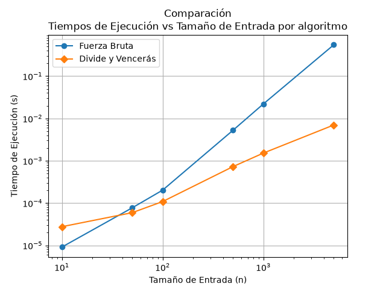

### Felipe Londoño García - Carné 21158186
### Grupo - 190304006-3

# Instrucciones para reproducir el experimento

## ¿Cómo preparar el entorno para el ejercicio de clase?
1. Inicie el entorno virtual, ejecute los comandos en CMD:
    - `python -m venv venv` para crearlo
    - `venv\Scripts\activate` para iniciarlo en Windows
    - `source venv/bin/activate` para iniciarlo en Linux/Mac
  
2. Asegúrese que el entorno virtual está activo. La terminal debería mostrar el texto (venv) como se ve en la imagen:

3. Instale las librerías del archivo de requerimientos. Ejecute en la terminal `pip install -r requirements.txt`

## Ejecute los archivos de Python
Ejecute cada programa directamente desde el entorno de desarrollo, o ejecute los siguientes comando en la terminal ubicándose en el directorio laboratorios\lab2-divide-y-vencer:
- `python pruebas.py` > [Pruebas - Parte 1](pruebas.py)
- `python medicion.py` > [Medicion - Parte 2](medicion.py)

>Al ejecutarse, cada programa imprimirá en la terminal el resultado de los rendimientos de cada experimento y mostrará en pantalla las gráficas, las cuáles además se guardan en la carpeta /graficas.

# Parte 1 — Implementar y verificar las dos soluciones

Link a las implementaciones:
- [Subarreglo.py](subarreglo.py)
- [Pruebas.py](pruebas.py)

Para verificar la correcta implementación de los algoritmos de fuerza bruta y divide y vencerás implementados en [Subarreglo.py](subarreglo.py), se creó el archivo [Pruebas.py](pruebas.py), el cual contiene pruebas automatizadas mediante instrucciones `assert`. En cada caso se comparó principalmente la suma máxima obtenida, ya que el enunciado establece que, cuando existen varios subarreglos con la misma suma óptima, cualquiera de ellos es válido.

Las pruebas cubren los siguientes escenarios:

1. Serie de ejemplo de la situación problema: `[-3, 5, -2, 8, -6, 3, 9, -4]`, verificando que ambos algoritmos obtengan una suma máxima de `17`.
2. Serie con un único elemento, para validar el caso base de la solución recursiva.
3. Serie con todos los valores negativos, comprobando que el algoritmo seleccione correctamente el valor menos negativo.
4. Serie con todos los valores positivos, donde la solución óptima corresponde a toda la lista.
5. Caso en el que el mejor subarreglo cruza el punto medio, con el fin de verificar la correcta implementación del caso cruzado en el algoritmo de divide y vencerás.
6. Veinte listas aleatorias reproducibles, generadas con una semilla fija, en las cuales se comprobó que ambos algoritmos producen exactamente la misma suma máxima.

Estas pruebas permitieron validar tanto la corrección de los resultados como el cumplimiento de las restricciones establecidas en el laboratorio, especialmente la correcta resolución de los casos izquierdo, derecho y cruzado en el algoritmo de divide y vencerás.

# Parte 2 - Medir y graficar

Para comparar el rendimiento de los algoritmos de fuerza bruta y divide y vencerás, se implementó el experimento en el archivo [Medicion.py](medicion.py). Se utilizaron seis tamaños de entrada: 10, 50, 100, 500, 1000 y 5000 elementos. Los datos se generaron mediante números enteros aleatorios entre -100 y 100, utilizando una semilla fija (42) para favorecer la reproducibilidad de las mediciones.

El tiempo de ejecución se midió con `time.perf_counter()`, registrando el tiempo inmediatamente antes y después de cada llamada a los algoritmos. Para cada tamaño se utilizó la misma lista de entrada en ambas implementaciones, lo que permite comparar sus tiempos bajo las mismas condiciones.

La gráfica compara los tiempos de ejecución de ambos algoritmos en función del tamaño de entrada. Se utilizaron escalas logarítmicas en los ejes horizontal y vertical para facilitar la visualización de las diferencias de rendimiento entre las dos soluciones.Los resultados permiten observar cómo varía el tiempo de ejecución al aumentar el tamaño de la entrada y comparar el comportamiento práctico de ambas implementaciones. La gráfica sirve como base para contrastar las mediciones con las complejidades teóricas de fuerza bruta, `θ(n^2)`, y divide y vencerás, `θ(n\log n)`.

# Parte 3 — Análisis en el README.md